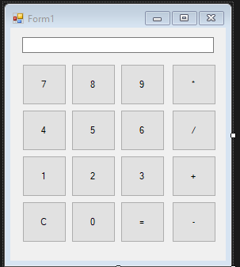

Zadanie: Prosty Kalkulator w Windows Forms w C# (P03ZadanieKalkulator)  
Cel zadania:

Celem tego zadania jest stworzenie prostego kalkulatora, podobnego do wbudowanego w systemie Windows, przy u¿yciu technologii Windows Forms w jêzyku
programowania C#.
Wymagania:

    Interfejs u¿ytkownika powinien sk³adaæ siê z:
        Przycisków numerycznych (0-9).
        Przycisków dla operacji dodawania, odejmowania, mno¿enia i dzielenia.
        Pola tekstowego (TextBox), w którym bêdzie wyœwietlany wynik.

    Utwórz oddzieln¹ klasê, która bêdzie zawiera³a metody do wykonywania operacji matematycznych.
    Klasa ta powinna udostêpniaæ metody do dodawania, odejmowania, mno¿enia i dzielenia dwóch liczb. 
    Pamiêtaj, aby obs³u¿yæ sytuacjê dzielenia przez zero.

    Logika kalkulatora powinna byæ odseparowana od logiki interfejsu u¿ytkownika. 
    Wszystkie obliczenia powinny byæ wykonywane w oddzielnej klasie, a nie bezpoœrednio w kodzie formularza.

Opcjonalne:

    Dodaj przycisk do czyszczenia wyœwietlacza.
    Dodaj przycisk do zmiany znaku liczby (plus/minus).

    